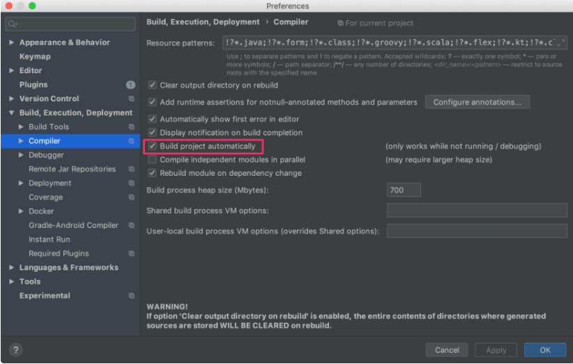
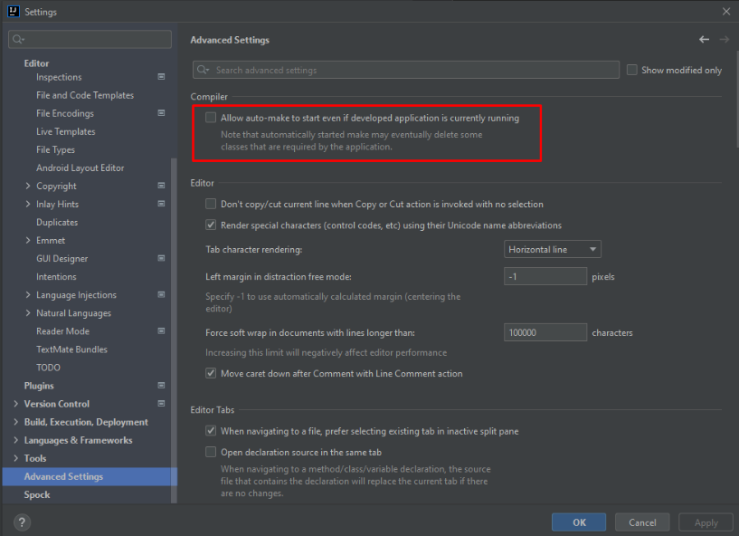
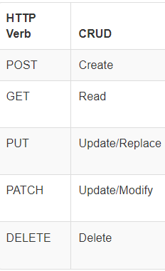
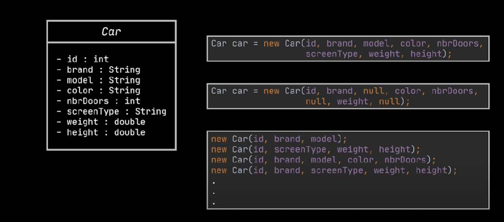
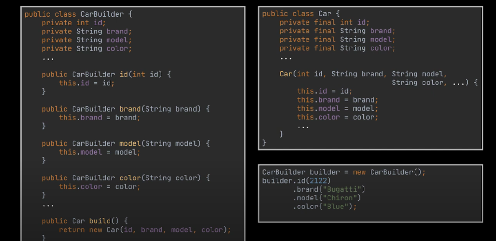
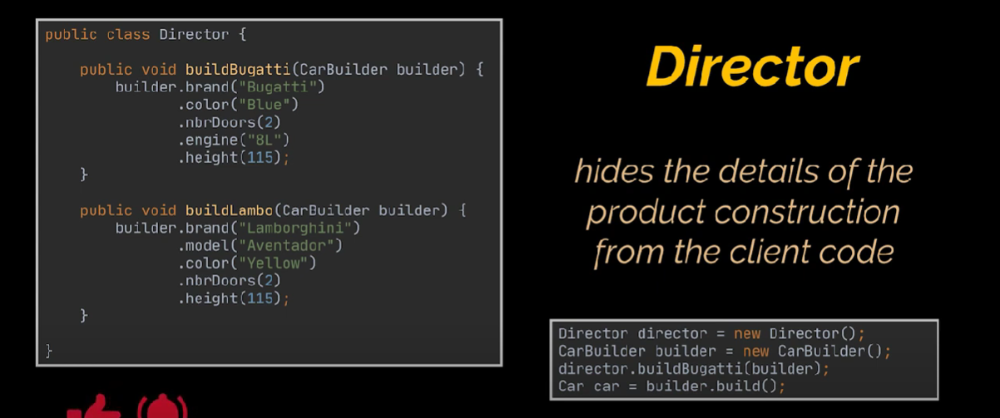

# Springboot-Tutorial


### Notes 

- DevTools Setup in Intelij.
- Add spring-boot-devtools dependency if not already added
- Enable Build project automatically as shown below




- Enable option in Advanced Settings as shown below.



### HTTP Verb vs CRUD




### H2 Database
H2 database is an open source, embedded and in memory relational database management system. It is written in Java and provides a client/server application. It stores data in system memory instead of disk. Once program is closed, data is also lost.

### @Bean
It is a method-level annotation. It is an alternative of XML <bean> tag. It tells the method to produce a bean to be managed by Spring Container.

### @Component

It is a class-level annotation. It is used to mark a Java class as a bean. A Java class annotated with @Component is found during the classpath. The Spring Framework pick it up and configure it in the application context as a Spring Bean.

### @ComponentScan
It is used when we want to scan a package for beans. It is used with the annotation @Configuration. We can also specify the base packages to scan for Spring Components.

### @Configuration

Spring Configuration annotation indicates that the class has @Bean definition methods. So Spring container can process the class and generate Spring Beans to be used in the application.

### @SpringBootApplication Annotation
Boot developers like their apps to use auto-configuration, component scan and be able to define extra configuration on their "application class". A single @SpringBootApplication annotation can be used to enable those three features, that is:

- @EnableAutoConfiguration: enable Spring Boot’s auto-configuration mechanism
- @ComponentScan: enable @Component scan on the package where the application is located (see the best practices)
- @Configuration: allow to register extra beans in the context or import additional configuration classes
- The @SpringBootApplication annotation is equivalent to using @Configuration, @EnableAutoConfiguration, and @ComponentScan with their default attributes,

### @Controller

A controller class is normally a class part of the Model View Controller (MVC) pattern. A controller basically controls the flow of the data.

The @Controller is a class-level annotation. It is a specialization of @Component. It marks a class as a web request handler. It is often used to serve web pages. By default, it returns a string that indicates which route to redirect. It is mostly used with @RequestMapping annotation.

- It controls the data flow into model object and updates the view whenever data changes.
- The @Controller annotation indicates that a particular class serves the role of a controller.


### @RequestMapping

- the annotation is used to map web requests to Spring Controller methods.
- We typically use @Controller in combination with a @RequestMapping annotation for request handling methods.
- We can use it with class definition to create the base URI. For example:

#### @RequestMapping with Class
```
@Controller
@RequestMapping("/home")
public class HomeController {

}
```
Now /home is the URL for which this controller will be used. 

#### @RequestMapping with Method

- We can use it with method to provide the URI pattern for which handler method will be used. For example:

```
@RequestMapping(value="/method0")
@ResponseBody
public String method0(){
return "method0";
}
```

### @Service

It is also used at class level. It tells the Spring that class contains the business logic.

### @Repository

It is a class-level annotation. The repository is a DAOs (Data Access Object) that access the database directly. The repository does all the operations related to the database.

### @EnableAutoConfiguration

It auto-configures the bean that is present in the classpath and configures it to run the methods. The use of this annotation is reduced in Spring Boot 1.2.0 release because developers provided an alternative of the annotation, i.e. @SpringBootApplication.

### @SpringBootApplication

It is a combination of three annotations @EnableAutoConfiguration, @ComponentScan, and @Configuration.

### @Entity 
annotation specifies that the class is an entity and is mapped to a database table.

### @autowired
Autowiring feature of spring framework enables you to inject the object dependency implicitly. It internally uses setter or constructor injection.

### @PathVariable 
The annotation is used to extract the value of the template variables and assign their value to a method variable.

### @Builder
This annotation produces complex builder APIs for your classes. @Builder lets you automatically produce the code required to have your class be instantiable with code

### @ControllerAdvice
It is a specialization of the @Component annotation which allows to handle exceptions across the whole application in one global handling component

### @ResponseStatus
This marks a method or exception class with the status code and reason message that should be returned. The status code is applied to the HTTP response when the handler method is invoked, or whenever the specified exception is thrown

## Spring MVC and REST Annotations

### @RequestMapping

It is used to map the web requests. It has many optional elements like consumes, header, method, name, params, path, produces, and value. We use it with the class as well as the method.

### @GetMapping
It maps the HTTP GET requests on the specific handler method. It is used to create a web service endpoint that fetches It is used instead of using: @RequestMapping(method = RequestMethod.GET)

### @PostMapping
It maps the HTTP POST requests on the specific handler method. It is used to create a web service endpoint that creates It is used instead of using: @RequestMapping(method = RequestMethod.POST)

### @PutMapping 
It maps the HTTP PUT requests on the specific handler method. It is used to create a web service endpoint that creates or updates It is used instead of using: @RequestMapping(method = RequestMethod.PUT)

### @DeleteMapping
It maps the HTTP DELETE requests on the specific handler method. It is used to create a web service endpoint that deletes a resource. It is used instead of using: @RequestMapping(method = RequestMethod.DELETE)

### @PatchMapping
It maps the HTTP PATCH requests on the specific handler method. It is used instead of using: @RequestMapping(method = RequestMethod.PATCH)

### @RequestBody
It is used to bind HTTP request with an object in a method parameter. Internally it uses HTTP MessageConverters to convert the body of the request. When we annotate a method parameter with @RequestBody, the Spring framework binds the incoming HTTP request body to that parameter.

### @ResponseBody
It binds the method return value to the response body. It tells the Spring Boot Framework to serialize a return an object into JSON and XML format.

### @PathVariable
It is used to extract the values from the URI. It is most suitable for the RESTful web service, where the URL contains a path variable. We can define multiple @PathVariable in a method.

### @RequestParam
It is used to extract the query parameters form the URL. It is also known as a query parameter. It is most suitable for web applications. It can specify default values if the query parameter is not present in the URL.

### @RequestHeader
It is used to get the details about the HTTP request headers. We use this annotation as a method parameter. The optional elements of the annotation are name, required, value, defaultValue. For each detail in the header, we should specify separate annotations. We can use it multiple time in a method

### @RestController
It can be considered as a combination of @Controller and @ResponseBody annotations. The @RestController annotation is itself annotated with the @ResponseBody annotation. It eliminates the need for annotating each method with @ResponseBody.

### @RequestAttribute
It binds a method parameter to request attribute. It provides convenient access to the request attributes from a controller method. With the help of @RequestAttribute annotation, we can access objects that are populated on the server-side.


### Builder Pattern

Builder pattern was introduced to solve some of the problems with Factory Pattern

- Too Many arguments to pass from client program to the Factory class that can be error prone because most of the time, the type of arguments are same and from client side its hard to maintain the order of the argument.
- Some of the parameters might be optional but in Factory pattern, we are forced to send all the parameters and optional parameters need to send as NULL.
- If the object is heavy and its creation is complex, then all that complexity will be part of Factory classes that is confusing.






